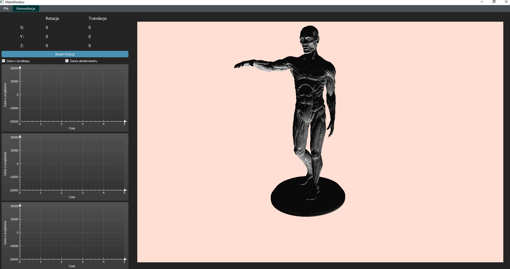
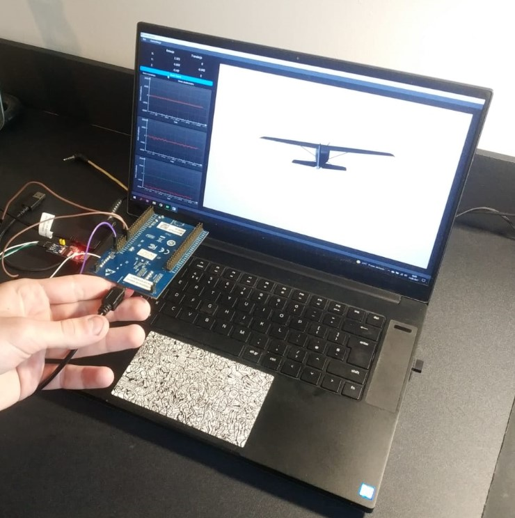
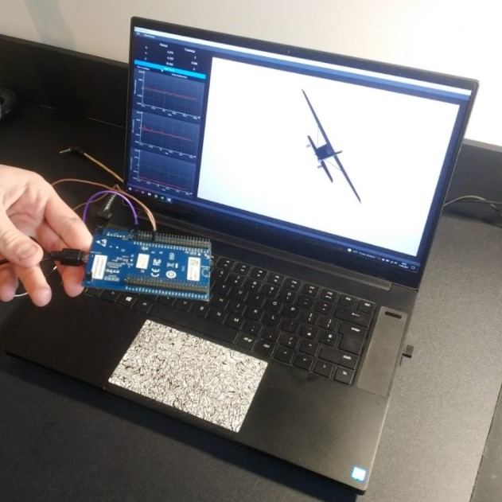
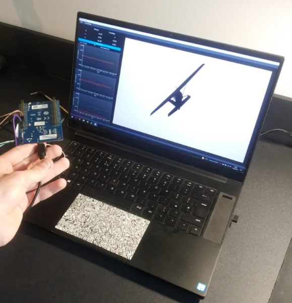
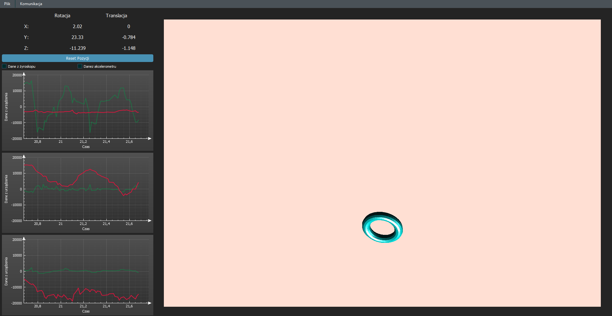

# Manipulacja obiektu 3D za pomocą żyroskopu i akcelerometru

# Główne cechy projektu
## Opis funkcjonalności aplikacji:
- [X] Pasek narzędzi – W pasku narzędzi można wyszukać urzędzenia podłą-
czone do portów COM, następnie połączyć się z płytką wybierając odpowiedni
port. Możliwy jest również wybór pliku z modelem 3D, którym chcemy manipu-
lować.
- [X] Pasek statusu – Na pasku statusu, wyświetlany zostaje komunikat tekstowy z
nazwą portu COM wybranegp przez użytkownika, który będzie wykorzystywany
do komunikacji z płytką rozwojową.
- [X] Tabela z danymi – Tabela w której będzie można zobaczyć orientację oraz
przesunięcie obiektu 3D względem jego położonia początkowego
- [X] Reset pozycji – zrestartowanie położenia obiektu 3D do jego początkowego
położenia
- [X] Przyciski do wyboru wyświetlanych danych na wykresach – Zaznaczając
odpowiedni checkbox użytkownik może wybrać z którego czujnika będą wyświe-
tlane dane na wykresach. Możliwe jest zaznaczenie obu checkbox’ów na raz co
spowoduje jednoczesne wyświetlanie danych.
- [X] Widget z wizualiacją 3D – Obserwacja wizualizacji obiektu 3D manipulowa-
nego za pomocą akcelerometru z żyroskopem lub myszki i klawiatury
- [X] Wykresy danych – Wykresy danych odczytywanych z akcelerometru i żyrosko-
pu

## Prezetacja procesu zmiany orientacji i położenia obiektu 3D za pomocą płytki deweloperskiej z wbudowanym układem MEMS

## Wykresy danych sensorycznych

## Dokumentacja
Link do dokumentacji doxygen:
https://drive.google.com/drive/folders/1Zru7rwTKC2_0PqNryoxwpd-XHhf7YqBr?usp=sharing
